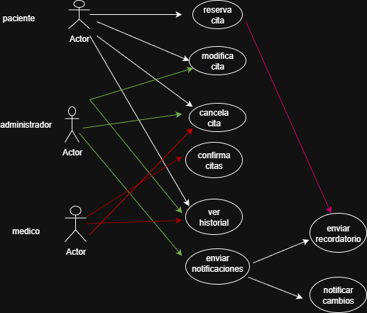

# Tarea 3 – Sistema de Reservas Hospitalarias

Este proyecto corresponde a la **Tarea 3** y tiene como objetivo modelar un sistema de reservas de citas médicas utilizando diagramas UML.

---

##  Actores

- **Paciente**  
  Puede reservar, modificar y cancelar citas, además de consultar su historial.

- **Médico**  
  Confirma citas y accede al historial de pacientes.

- **Administrador**  
  Gestiona modificaciones y cancelaciones, consulta historiales, envía recordatorios y notifica cambios.

- **Sistema de Notificaciones** (actor técnico)  
  Envía recordatorios automáticos y notificaciones de cambios.

---

##  Casos de uso

- Reservar cita  
- Modificar cita  
- Cancelar cita  
- Confirmar cita  
- Ver historial  
- Enviar recordatorios  
- Notificar cambios  

---

##  Diagrama de casos de uso

---

##  Notas de diseño

- Se utilizó el enfoque **Top-Down**, comenzando por la visión general del sistema y luego descomponiendo en módulos.  
- Los casos de uso están organizados dentro del límite del sistema (rectángulo UML).  
- Se recomienda documentar también el **diagrama de clases** para complementar la especificación.

---

##  Estructura del repositorio

- `diagrama/diagrama.png` → Diagrama de casos de uso exportado desde diagrams.net.  
- `README.md` → Documentación explicativa del sistema y sus actores.
